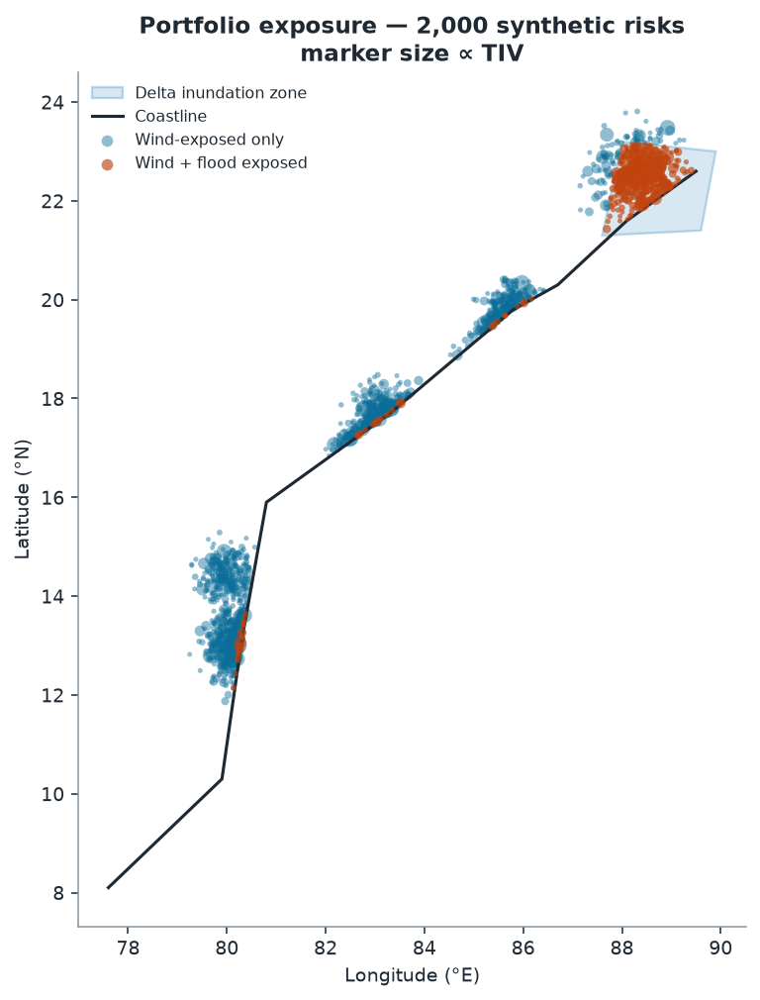
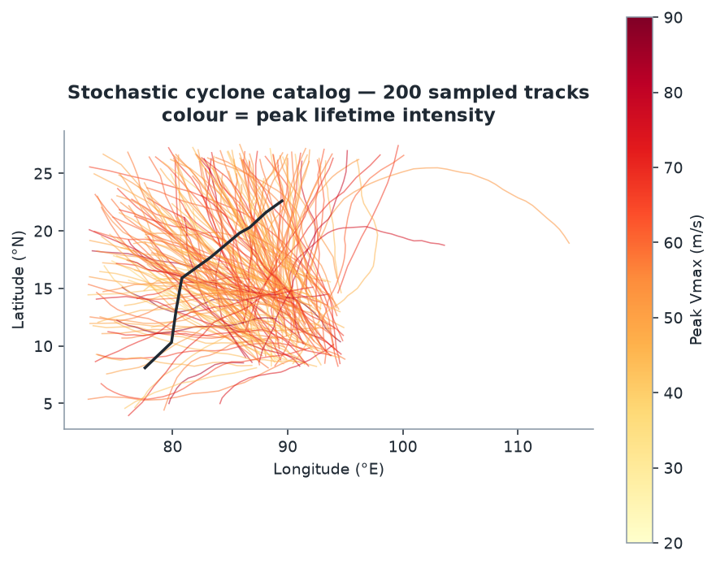
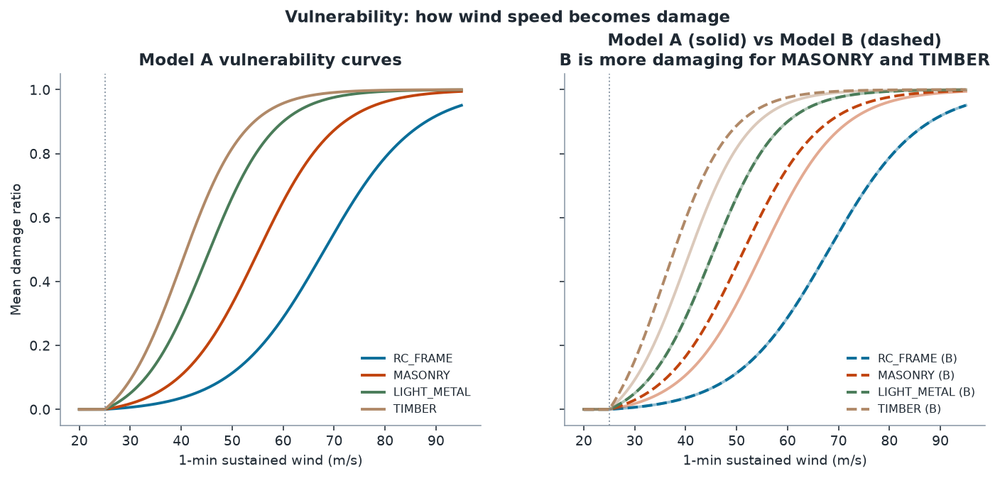
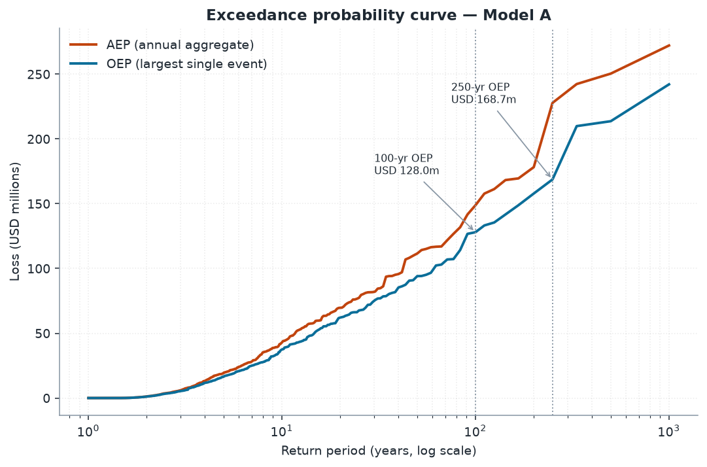
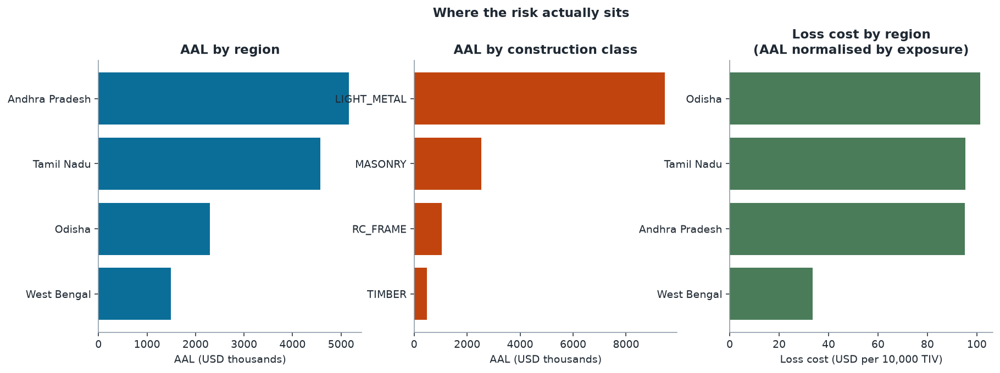
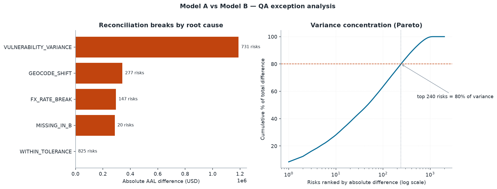
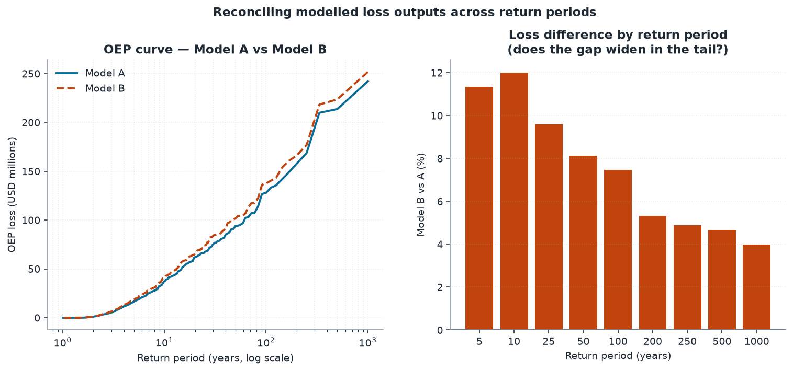

# A.R.C. — Advanced Rupture & Catastrophe Intelligence

**An end-to-end catastrophe risk modelling platform for tropical cyclone risk in the Bay of Bengal.**

A.R.C. reproduces the full working pipeline of a catastrophe risk analyst, from
raw exposure through to the exception report a broker actually reads:

```
  EXPOSURE  →   HAZARD    →   LOSS     →  RECONCILE  →   EXPLAIN
  portfolio     1,000-yr      AAL, EP      Model A vs     figures +
  + SQL         stochastic    curves,      Model B QA     interpretation
  schema        catalog       OEP/AEP      exception
                                           report
```

Built in Python and SQL. Fully self-contained — no API keys, no internet, no
external downloads. The complete pipeline runs in **under 30 seconds** and is
reproducible to the rupee: every random draw is seeded.

---

## Contents

- [Headline results](#headline-results)
- [Architecture](#architecture)
- [Phase 1 — Exposure](#phase-1--exposure)
- [Phase 2 — Stochastic hazard](#phase-2--stochastic-hazard)
- [Phase 3 — Vulnerability and loss](#phase-3--vulnerability-and-loss)
- [Phase 4 — Reconciliation and QA](#phase-4--reconciliation-and-qa)
- [Phase 5 — Cross-model comparison](#phase-5--cross-model-comparison)
- [Principal findings](#principal-findings)
- [Limitations](#limitations)
- [Running A.R.C.](#running-arc)

---

## Headline results

| Metric | Value |
|---|---|
| Portfolio | 2,000 risks, USD 1,693m total insured value |
| Simulation | 1,000 years · 2,465 cyclones · 1,671 affecting the portfolio |
| **Average Annual Loss** | **USD 13.52m** — 0.799% of TIV |
| Annual loss volatility | SD USD 29.27m · coefficient of variation **2.16** |
| Loss-free years | 287 of 1,000 |
| **100-year OEP** | **USD 128.0m** |
| **250-year OEP** | **USD 168.7m** |
| Model A vs Model B | AAL differs **+10.90%**; 250-yr OEP differs only **+4.9%** |
| QA exceptions raised | 1,175 of 2,000 risks across 4 root causes |
| Break detection | 100% precision · 100% / 98.7% / 92.3% recall |

---

## Architecture

Six sequential phases, each writing to a shared SQLite database
(`outputs/catrisk.db`, 24 tables). Every phase reads only what its predecessors
wrote, so the pipeline is inspectable at each boundary.

| Phase | Module | Capability demonstrated |
|---|---|---|
| 0 | `phase0_setup.py` | Environment control, reproducible teardown/rebuild |
| 1 | `phase1_exposure.py` | Exposure modelling, SQL schema design, geospatial flagging |
| 2 | `phase2_hazard.py` | **Stochastic modelling** — Monte Carlo, correlated random walk, wind field physics |
| 3 | `phase3_loss.py` | **Loss outputs** — vulnerability curves, AAL, OEP/AEP, return periods |
| 4 | `phase4_reconciliation.py` | **Quality assurance** — SQL CTEs, window functions, exception reporting |
| 5 | `phase5_dashboard.py` | **Communication** — visualisation and interpretation for non-modellers |

---

## Phase 1 — Exposure

A synthetic portfolio of 2,000 risks distributed across five coastal centres
(Chennai, Nellore, Visakhapatnam, Puri, Kolkata), each carrying coordinates,
total insured value, construction class, occupancy, currency and deductible.
A static delta-inundation polygon and a 3 km coastal surge band provide a
second peril view for exposure flagging.



> **Inference.** 484 risks (24.2%) fall inside the flood-flagged zone, and
> they are not evenly spread — the delta polygon concentrates them around the
> West Bengal book. This is the multi-peril accumulation question in miniature:
> a single Kolkata event can strike the same risks through both wind and water,
> so treating the two perils as independent would understate the correlated
> tail. 149 risks (7.5%) are written in a non-USD currency, which becomes the
> source of a reconciliation break in Phase 4.

---

## Phase 2 — Stochastic hazard

A 1,000-year event catalog built from first principles:

- **Frequency** — cyclones per year ~ Poisson(λ = 2.5) → 2,465 events.
- **Track** — a correlated random walk. Bearing and translation speed persist
  step to step with Gaussian perturbations, producing realistic track bundles
  without fitting a full historical transition matrix.
- **Intensity** — over sea, Vmax relaxes exponentially toward a storm-specific
  potential intensity; over land it decays on the Kaplan–DeMaria form
  `Vb + (V0 − Vb)·exp(−α·t)` with α = 0.095/hr.
- **Wind field** — parametric radial profile: linear inside the radius of
  maximum winds, decaying as `(Rmax/r)^0.6` beyond it.

Each property's hazard for an event is its maximum wind across all track steps.



> **Inference.** 2,043 of 2,465 events (82.9%) make landfall, but only 1,671
> (67.8%) generate any portfolio wind at all — the gap is the set of storms
> that come ashore away from the insured centres. The colour gradient shows
> intensity decaying rapidly once tracks cross the coastline, which is why
> inland risks contribute so little to AAL despite being numerous. Critically,
> **287 of 1,000 years produce no loss whatsoever**; those years must remain in
> the denominator of every return-period calculation.

---

## Phase 3 — Vulnerability and loss

Logistic damage functions by construction class, rebased so damage is exactly
zero at the 25 m/s threshold:

```
MDR(v) = [σ(v) − σ(25)] / [1 − σ(25)],   σ(v) = 1 / (1 + e^(−k(v − v50)))
```

| Class | v50 (m/s) | Interpretation |
|---|---|---|
| RC_FRAME | 68 | Reinforced concrete — most resilient |
| MASONRY | 55 | Typical mid-range construction |
| LIGHT_METAL | 45 | Industrial sheds — vulnerable |
| TIMBER | 40 | Most vulnerable |

Financial terms: `net = clip(TIV × MDR − deductible, 0, TIV)` at a 5% deductible.



> **Inference.** The curves are steep and well separated in the 40–70 m/s band,
> which is precisely where most landfalling intensity sits — so construction
> class, not location, is the dominant driver of relative loss. Above roughly
> 80 m/s all four curves saturate toward total loss, meaning construction
> quality stops differentiating outcomes in the most extreme events. That
> saturation turns out to explain the Phase 5 result.



> **Inference.** AAL is USD 13.52m (0.799% of TIV) — the pure technical premium
> for this peril before expenses, profit and cost of capital. The coefficient
> of variation of **2.16** is the headline risk-management number: annual
> volatility is more than double the mean, which is the quantitative argument
> for transferring this risk rather than retaining it. The AEP curve sits above
> OEP throughout, and the widening gap beyond the 50-year return period shows
> multi-event seasons becoming a material share of aggregate risk.



> **Inference.** Ranked by AAL, Andhra Pradesh leads (USD 5.16m), but ranked by
> **loss cost** — AAL normalised by TIV — the order changes materially. Odisha
> carries roughly **three times** the loss cost of West Bengal (≈101 vs ≈34 per
> 10,000 TIV) despite holding half the insured value. West Bengal's large book
> sits further from the modal landfall corridor and benefits from inland decay.
> This is why raw AAL is the wrong basis for allocating reinsurance spend:
> the largest loss is not the most expensive risk per unit of exposure.

---

## Phase 4 — Reconciliation and QA

Model B is the same portfolio with four deliberately injected defects — the
four that genuinely generate reconciliation queries in practice:

| Defect | Injection | Effect |
|---|---|---|
| Vulnerability assumption | MASONRY & TIMBER v50 lowered 4 m/s | Systematic, many risks slightly |
| Coarse geocoding | 15% rounded to 1 dp (~11 km) | Risks move relative to the wind field |
| Stale FX rate | Non-USD risks +10% TIV | Overstated exposure |
| Failed load | 1% dropped entirely | Missing exposure |

The reconciliation SQL classifies breaks **blind** — purely from the two
exposure files and the two loss outputs, using CTEs, `RANK()` and windowed
cumulative sums for Pareto concentration. Only afterwards is the classification
scored against the manifest of what was actually injected.



| Root cause | Risks | Net diff (USD) | Share of absolute difference |
|---|---:|---:|---:|
| VULNERABILITY_VARIANCE | 731 | +1,189,493 | 56.3% |
| GEOCODE_SHIFT | 277 | +276,394 | 16.2% |
| FX_RATE_BREAK | 147 | +294,848 | 14.0% |
| MISSING_IN_B | 20 | −286,572 | 13.6% |
| WITHIN_TOLERANCE | 825 | +5 | 0.0% |

**Detection performance**

| Defect | Injected | Flagged | Recall | Precision |
|---|---:|---:|---:|---:|
| MISSING_IN_B | 20 | 20 | 100.0% | 100.0% |
| FX_RATE_BREAK | 149 | 147 | 98.7% | 100.0% |
| GEOCODE_SHIFT | 300 | 277 | 92.3% | 100.0% |

> **Inference.** **56.3%** of the AAL movement is genuine model uncertainty
> (the vulnerability assumption). The remaining **43.7% is attributable to data
> defects that can be fixed** — bad geocodes, a stale FX rate, a failed load.
> That split is the entire value of the exercise: it turns
> "the two models disagree by 11%" into a ranked, actionable remediation list.
> Note also that just **240 of 2,000 risks drive 80%** of the total absolute
> difference, so a QA analyst should review 12% of the book to resolve the bulk
> of the variance.
>
> The two recall shortfalls are explained, not hidden — which matters more than
> a clean 100%:
> - 23 of 300 regeocoded risks already sat on a 1-decimal coordinate, so
>   rounding moved them nowhere and left no detectable trace.
> - 2 of 149 FX risks were also in the dropped set, so they surface under
>   `MISSING_IN_B`; the classifier reports root cause by precedence.

---

## Phase 5 — Cross-model comparison



> **Inference — the most commercially significant result in A.R.C.**
> The divergence between the two models is **not uniform across the loss
> distribution**, and it narrows monotonically as severity increases:
>
> | Return period | 10-yr | 50-yr | 100-yr | 250-yr | 1000-yr |
> |---|---:|---:|---:|---:|---:|
> | Model B vs A | **+12.0%** | +8.1% | +7.5% | **+4.9%** | **+4.0%** |
>
> The headline AAL difference of +10.9% therefore **materially overstates the
> disagreement in the tail**. The cause is visible in Phase 3: both
> vulnerability curves saturate toward total loss at extreme wind speeds, so
> shifting v50 by 4 m/s changes mid-severity outcomes far more than extreme
> ones.
>
> The practical consequence: a reinsurance buyer pricing a **high excess-of-loss
> layer** would find the two models nearly in agreement, while the same two
> models disagree sharply on **AAL and working-layer pricing**. Quoting a single
> percentage difference between two models — without stating which part of the
> curve it refers to — is misleading.

---

## Principal findings

1. **Concentration.** `LIGHT_METAL` accounts for 9.9% of risks by count and
   31.5% by TIV, yet drives **69.9% of total AAL** (USD 9.45m of 13.52m). This
   is the interaction of high-TIV industrial occupancy with the second-most
   vulnerable construction class — a portfolio-management finding, not a
   modelling error.
2. **Model divergence is severity-dependent.** +12.0% at the 10-year return
   period, +4.0% at the 1,000-year. A single headline percentage conceals this.
3. **Nearly half the disagreement is fixable.** 43.7% of the A-vs-B variance is
   data quality rather than genuine model uncertainty; 240 risks explain 80% of it.
4. **Loss cost reorders the portfolio.** Odisha carries ~3× West Bengal's loss
   cost on half the TIV. Ranking by AAL alone misallocates reinsurance spend.
5. **Zero-loss years are load-bearing.** 287 of 1,000 years produce no loss.
   Excluding them would inflate every return period reported here.

---

## Limitations

Stated deliberately. Interrogating model uncertainty is core to catastrophe
analysis, and a model whose weaknesses cannot be named is one that is not
understood.

1. **Not calibrated to observations.** Track and intensity parameters are
   plausible for the basin but are not fitted to IBTrACS or any historical
   record. Absolute loss figures are not real risk estimates.
2. **Vulnerability curves are illustrative.** Smooth logistic functions chosen
   by construction class, not derived from claims data. In a real engagement
   this is the single largest source of loss uncertainty.
3. **Symmetric wind field.** The radial profile ignores asymmetry from forward
   motion, which in reality makes the right-front quadrant materially more
   damaging in this hemisphere.
4. **No storm surge or rainfall.** The flood layer is a static illustrative
   polygon used for exposure flagging only — it is not a hazard model and
   generates no loss. Only wind loss is modelled.
5. **Simplified financial terms.** Flat 5% deductible; no limits, sub-limits,
   reinsurance structures or demand surge.
6. **Distance-to-coast is an east-west approximation**, degrading where the
   coastline turns sharply near Odisha.
7. **Tail sampling uncertainty.** 1,000 years means the 1-in-1000 return period
   rests on a single simulated year. This is visible in the results: the AEP
   curve jumps from USD 178m at the 200-year return period to USD 228m at the
   250-year, a kink that reflects sampling noise rather than physics. **Treat
   anything beyond the 250-year return period as indicative only.**

---

## Running A.R.C.

Six modules, strictly sequential — each reads what the previous one wrote.

```bash
pip install numpy pandas matplotlib

for p in 0_setup 1_exposure 2_hazard 3_loss 4_reconciliation 5_dashboard; do
    python phases/phase${p}.py || break
done
```

**Kaggle:** each phase is self-contained with no cross-file imports — paste one
phase per cell and run top to bottom. Paths auto-detect `/kaggle/working`.
No internet required.

Full instructions, runtimes and the Kaggle dataset route: [`RUN_ORDER.md`](RUN_ORDER.md).

**Outputs:** `outputs/catrisk.db` (24 tables) and seven figures in
`outputs/figures/`.

---

## Résumé summary

> Built **A.R.C.**, an end-to-end catastrophe risk modelling platform in Python
> and SQL: a 1,000-year stochastic cyclone simulation (2,465 events) over a
> 2,000-property portfolio producing EP curves, AAL and 250-year OEP, plus a SQL
> reconciliation engine using CTEs and window functions that classifies loss
> discrepancies between model variants by root cause at 100% precision.
> Demonstrated that model divergence is severity-dependent (+12.0% at the
> 10-year return period vs +4.0% at the 1,000-year) and that 43.7% of
> cross-model variance was attributable to fixable data defects rather than
> genuine model uncertainty.

## Interview talking points

- Why loss-free years must remain in the EP calculation, and what breaks if they don't.
- Why a coefficient of variation of 2.16 is the quantitative argument for buying reinsurance.
- Why "1-in-250" is an annual probability, not a schedule — implying roughly a
  3.9% chance of occurrence across a 10-year treaty.
- Why the reconciliation separates *data defects* (fixable) from *model
  uncertainty* (genuine), and why that distinction is what a broker actually needs.
- Why a single "the models differ by X%" figure is misleading, and how the
  divergence narrows from +12.0% to +4.0% across the loss curve.
- Why AAL concentrated in 9.9% of risks by count is a portfolio finding rather
  than a modelling error.
